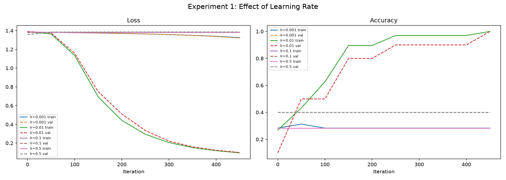
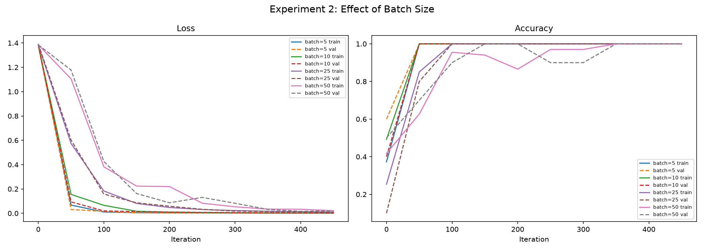
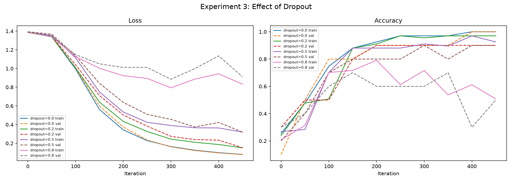
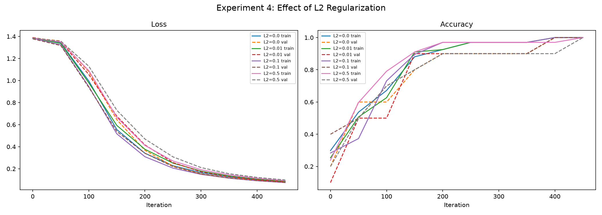

# A Small ML Model for Classifying Bottles

This is small Machine Learning model using Neural Networks which can classify between different bottles of similar design but different colours . In essence it can differentiate between colour. The dataset is 60 pictures of these bottles in different lightings and backgrounds.

---

## The Experiments Performed

The following model has been tested through 4 experiments

### Experiment 1: Learning Rate

This tests the size that the weight of each node is update during the training of the model.

It is used to determine which is appropriate Learning rate for the model to give accurate predictions.

Too large a value prevents learning.

### Experiment 2: Batch Size

This tests the amount of images that the model see before updating its weights.

The important result is the speed at which they achieve the solution.

### Experiment 3: Dropout

It tests the technique which switches certain neurons as to ensure that the model doesn't just memorise the the training data.

Too little can lead to overfitting of the model.
Too much hampers any learning.

### Experiment 4: L2 Regularisation

It ensures that the model doesn't have huge weights and keeps it small and simple.

Large values lead to Slow learning.

---

## Observations

### Experiment 1: Learning Rate

`lr = 0.01` was the best with almost 100% accuracy.
`lr = 0.001` was the slowest with low accuracy.
`lr = 0.1` and `lr = 0.5` both failed and did not give any outcome.

### Experiment 2: Batch Size

`batch = 5` & `batch = 10` had the fastest result.
`batch = 50` was the slowest.

### Experiment 3: Dropout

`dropout = 0.0` and `dropout = 0.2` had the best result with little negative outcome.
`dropout = 0.5` was slow but still provided a good result.
`dropout = 0.8` had the most unstable accuracy varying between 40-100%.

### Experiment 4: L2 Regularisation

`L2 = 0.0` and `L2 = 0.01` had the same effect.
`L2 = 0.1` was slower but still had 100% accuracy.
`L2 = 0.5` was the slowest due to the high penalty.

---

## What Changed and Why

- **Learning rate** was the most important parameter as small value have slow learning and large values and bogus result.
- **Batch size** had no impact on accuracy but only on the speed . Smaller the size faster is the outcome.
- **Changes to dropout** had the most impact on the stability of the model . Huge values broke the model.
- **L2 values** had the minimalist impact . High values reduced the speed for the outcome.

---

## Things That Failed/Confused You

- `lr = 0.5` was a complete failure with no outcomes after 500 iterations.
- `dropout = 0.8` was unstable with no set accuracy.
- `lr = 0.1` was supposed to be slow but it never passed and got stuck.

---

## Insights/Questions Discovered

Every hyper parameter as a perfect value and extreme value doesn't give desired outcome.

**Questions:**
- What would the impact of a higher dataset be ?
- What will be the changes expected in a higher dataset ?
- Are the results skewed due to the choice of the dataset ?
